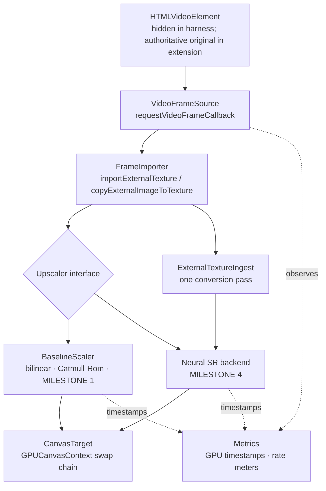

# ARCHITECTURE.md

AetherVSR upscales web video on the GPU, locally, in real time. This document
describes what exists today: a WebGPU video pipeline with two interchangeable
upscaling stages - the non-neural baseline scalers of Milestone 1 and the C16D2
neural network of Milestone 4.

Both run behind the same `Upscaler` interface, are selectable at runtime, and
the neural stage is automatically replaced by a baseline when it cannot hold the
frame budget. Milestones 2 and 3 added isolated neural/inference benchmark
experiments under `src/bench/` — convolution throughput harnesses, an
ONNX Runtime Web probe, a device roofline probe and a temporal-behaviour
harness — which are reachable only from `bench.html` and never from the
video path.

The standalone harness and M10 MV3 extension reuse `RuntimeDriver`,
`RuntimeController` and `VideoPipeline`, including the same production upscalers.
M10 and M10.5 both closed **EXTENSION MVP PARTIAL**: integration works within a
bounded scope, but registered delivery loss still fails. M10.5 verified Chrome
extensions-page reload with same-document explicit reactivation; runtime-API
reload automation remains unverified. See [docs/M10.5-REPORT.md](docs/M10.5-REPORT.md)
and the separate historical measurements in [BENCHMARKS.md](BENCHMARKS.md).

M10.5 changes only extension geometry/validation, not shared inference or
controller policy. Coincident circular pixel ancestor clips use a rounded
clip-path intersected with rectangular clipping; size-query containers require
actual canvas-coordinate verification before output. Unresolved containing blocks,
zoom, effects, conflicting clips and passive-caption ordering fail closed. Fullscreen
uses its actual top-layer clipping boundary. These checks run during geometry
reconciliation, not per-frame layout/pixel readbacks. Diagnostic frame accounting,
callback timing and Chrome traces are unshipped tools, never policy inputs.

M10.6 adds only diagnostic control and measurement tooling. Its infrastructure-only
attachment retains discovery/ownership/geometry while skipping GPU initialization;
the option and branch are absent from production builds. Native/public observers
do not steer the runtime. A test-only HLS parser identifies advertised public-media
catalogs without changing source selection or security. No stage boundary, model,
controller threshold or production permission changes. The measured native-floor
decision is Case D/PARTIAL; public same-DOM misalignment remains a documented
limitation despite passing fixture lifecycle and output parity. See
[docs/M10.6-REPORT.md](docs/M10.6-REPORT.md).

M10.7 closes presentation synchronization **FAIL**, overall extension **PARTIAL**.
Known invalidation now hides output synchronously and fences reveal with separate
geometry/source/output epochs. Inspection retains bounded current style, clipping
and placement proofs, revalidated after owned canvas insertion. ADR-0047 records
the design. The stronger S2 live-proof guard runs only when explicitly selected
in a diagnostic build; its measured cost did not qualify. Production S1 retains
the documented unannounced-layout gap and cannot promise the full invariant.
The four GPU stages, model, runtime policy and permissions remain unchanged.
See [docs/M10.7-REPORT.md](docs/M10.7-REPORT.md).

M10.8 selected **NO ARCHITECTURE QUALIFIED** (ADR-0048). Local A/D geometry
sentinels missed semantic CSSOM changes, the tested B lease failed concurrent
ownership restoration, and C required intrusive reparenting. No candidate earned
cost qualification. The diagnostic control and production payloads remain unchanged;
no architecture integration or new GPU data flow was introduced. These scoped
counterexamples do not prove every browser-maintained relationship impossible.
See [docs/M10.8-REPORT.md](docs/M10.8-REPORT.md).

**What Milestone 3 settled about the neural stage, and Milestone 4 built.** Its
kernels are hand-written WGSL rather than a third-party runtime, and they took
the shape `src/bench/conv-blocked.wgsl.ts` established - see
`src/core/neural/conv.wgsl.ts`: workgroup-tiled with a halo, input channels
packed into `vec4`, several output channels accumulated per invocation, and
weights pre-arranged tap-major at load time. That shape is not a preference; it
is 8.3x faster than the naive kernel it replaced, and each part of it was
measured separately (`BENCHMARKS.md`). The operating point that fits the frame
budget is C16 at 1280x720, where one 3x3 layer costs 1.067 ms.

ONNX Runtime Web is not a candidate for the video path: version 1.29.0 cannot
accept a caller-supplied `GPUDevice`, so it cannot read a decoded frame without
a round trip through host memory (ADR-0018). `chromium-experimental-subgroup-matrix`
is rejected on measurement and on availability (ADR-0017).

## Data flow



Every path shown is implemented. `U` dispatches to exactly one of `B` or `N` per
frame; the runtime controller decides which. Dotted edges are observation, not data
flow.

The hidden decode target is a harness choice, not a pipeline requirement. The
extension keeps the original page video beneath its owned canvas. Playback,
audio, seeking, source selection and page controls remain page-authoritative;
unsupported or suspended enhancement reveals the original instead of changing it.

## Stages

### 1. Frame acquisition — `src/core/acquisition/video-source.ts`

Turns an `HTMLVideoElement` into a stream of `FrameTick`s using
`requestVideoFrameCallback` (rVFC). rVFC fires when a frame is *sent to the
compositor*, so the pipeline is synchronised to presented video frames rather
than to display refresh. Callbacks are one-shot and re-registered every frame,
as the specification requires.

`FrameTick` normalises exactly what the pipeline needs: timestamp, media time,
decoded frame dimensions, presentation and expected-display times, the
`presentedFrames` delta, and the optional UA-reported decode latency.

An `requestAnimationFrame` fallback exists for browsers without rVFC. It is
selected by feature detection, not by browser sniffing; rVFC is available in
Chrome 83+, Safari 15.4+ and Firefox 132+, so the fallback is for older or
unusual engines.
It is explicitly a degraded mode: it ticks at display rate regardless of video
cadence, and the overlay labels it as such so its numbers are never mistaken
for rVFC numbers.

This stage holds no GPU resources. That is what makes it independently
testable — `test/video-source.test.ts` drives it with a controllable fake clock
and no GPU at all.

### 2. Frame import — `src/core/acquisition/frame-importer.ts`

Gets the decoded frame into GPU-visible form by one of two strategies, chosen
once at construction:

| Strategy | Mechanism | Notes |
|---|---|---|
| `external` | `GPUDevice.importExternalTexture()` | Wraps the decoder's surface. In Chromium this reaches a genuine no-copy path only when several internal conditions hold (shared image, NV12, multi-planar support, WebGPU-compatible backing, supported colour space); otherwise the browser copies internally. Zero-copy is an optimisation, not an API guarantee. |
| `sampled` | `GPUQueue.copyExternalImageToTexture()` into a texture we own and reuse | One GPU-side copy per frame. Used when external textures are unavailable, and forceable with `?import=copy` so the path stays testable on hardware that does not need it. |

Neither path reads pixels back to the CPU.

The distinction reaches the shader: an external texture is `texture_external` in
WGSL and can only be read with `textureSampleBaseClampToEdge`, while a copied
frame is an ordinary `texture_2d<f32>`. These are different types, so the
baseline scaler compiles a different shader module per strategy — resolved once
at configuration time, never branched per frame.

### 3. Upscale — `src/core/upscale/`

The replaceable stage. `Upscaler` (in `src/core/types.ts`) is the project's
central contract:

```ts
interface Upscaler {
  readonly id: string;
  readonly label: string;
  readonly scaleFactor: number;
  readonly neural: boolean;

  configure(config: UpscalerConfig): void;
  encode(ctx: EncodeContext): void;
  destroy(): void;
}
```

- `configure()` receives the device, source and target geometry, target format
  and source binding kind. Every GPU object an implementation needs is created
  here. It is called on start and on geometry change, never per frame.
- `encode()` runs in the hot path. It receives a command encoder, the frame, the
  destination view, and optional GPU timestamp slots. It must not allocate
  GPU resources, must not read back, and must not await.
- `scaleFactor` lets the harness size the output canvas without knowing the
  algorithm, so a 4x model needs no change to the pipeline, acquisition, import
  or presentation. It still needs an entry in the harness's upscaler list in
  `src/main.ts`.

`BaselineScaler` implements it with a single fullscreen render pass over a
three-vertex oversized triangle, in one of two reconstruction filters:

- **Bilinear** — one hardware-filtered tap. The cheap floor.
- **Catmull-Rom bicubic** — the separable 4x4 cubic evaluated as nine
  bilinear-fused taps rather than sixteen point taps. Sharper, with the ringing
  characteristic of a negative-lobe kernel; the result is clamped.

Both are deliberately non-neural. They exist to prove the path and to be the
quality and cost baseline every future model is measured against.

### 4. Presentation — `src/core/present/canvas-target.ts`

Owns the canvas and its swap chain. The backing store is set to exactly
`source x scaleFactor` — never multiplied by `devicePixelRatio`. A 1280x720
decode always produces a 2560x1440 buffer; CSS then letterboxes that fixed
buffer into the viewport. Conflating backing-store size with CSS size on a
Retina display is the standard way to end up benchmarking a scale factor you
did not intend.

The context is configured with the preferred canvas format (`bgra8unorm` on
macOS Chromium), `alphaMode: 'opaque'`, and `colorSpace: 'srgb'` to match the
destination colour space that `importExternalTexture()` converts into.

### 4b. Ingest — `src/core/ingest/` (Milestone 2)

`ExternalTextureIngest` converts the imported frame into an ordinary
`GPUTexture` in a single pass. The baseline scaler does not use it — one tap
does not justify a pass — but any multi-tap consumer should.

This is measured, not assumed. A `texture_external` tap costs ≈0.360 ms per
720p frame against ≈0.100 ms for an ordinary `texture_2d<f32>` tap, and the
ingest pass costs ≈0.36–0.45 ms, so it repays itself at roughly two taps.
Nine-tap Catmull-Rom drops from 3.765 ms to 1.703 ms total GPU time. A 3x3
convolution reads nine times per output pixel *per input channel*.

The output is `TEXTURE_BINDING | RENDER_ATTACHMENT`, so it is both sampleable
by a convolution and usable as a ping-pong render target — the two things a
multi-pass neural graph needs. See DECISIONS.md ADR-0012.

### 5. Metrics — `src/core/metrics/`

- `SampleWindow` — fixed-capacity ring buffer with mean, quantiles and max.
  Allocation-free on push.
- `RateMeter` — sliding-window rate over observed intervals, so it is exact for
  a periodic source and correct before the window fills.
- `GpuTimer` — real GPU execution time of the upscale pass via
  `timestamp-query`, using a fixed pool of resolve/staging buffers. A frame
  with no free slot is simply left unmeasured; the loop never blocks.

The timing overlay refreshes on a 250 ms timer, not from the frame callback.
Instrumentation still has overhead; benchmarks record the apparatus rather
than assuming observation is free.

## Orchestration

`VideoPipeline` (`src/core/pipeline.ts`) wires the stages and owns the hot path.
Per frame it performs exactly: acquire tick, ensure configuration, mark meters,
import frame, claim a timestamp slot, create a command encoder, call
`upscaler.encode()`, resolve timestamps, submit, start the timestamp readback.
No awaits, no readbacks, no allocation beyond what WebGPU mandates.

## The neural stage

`NeuralUpscaler` (`src/core/upscale/neural-upscaler.ts`) is a second
implementation of `Upscaler`, selected with `?upscaler=neural`. It is the whole
of Milestone 4, and it required no change to acquisition, import or
presentation — which was the point of the seam.

The graph, at 1280x720 in, 2560x1440 out:

```
GPUExternalTexture
  → ingest pass            external texture → rgba8unorm texture, once per frame
  → stem 5x5 3→16          texture-native, reads the image directly
  → body 2 × 3x3 16→16     packed vec4 activations, ping-pong buffers
  → resize-conv head       nearest 2x upsample then 3x3 16→3, writes a storage texture
  → blit                   storage texture → swap-chain view
```

Each stage is its own compute pass so each can be timed, and WebGPU's ordering
between passes in a command buffer means the ping-pong chain needs no explicit
barrier. The head is a resize convolution rather than a pixel shuffle for the
reasons in ADR-0022; the pixel-shuffle operator survives only under `src/bench/`
and nothing in `src/core/` imports it.

**Resources.** Everything is allocated in `configure()`: two activation buffers
sized to the largest layer, the ingest texture, the output storage texture,
weights, and a query set. The only per-frame GPU object is the bind group that
references the external-texture-derived view, and only when that view changes —
`GPUExternalTexture` is single-frame-valid by specification, so this is the one
allocation the `Upscaler` contract permits.

**Timing.** The pipeline's own span brackets the whole stage, from the first
pass to presentation, and that is the published number. Per-pass spans are
diagnostics on a separate query set, each aggregated over 240 samples; they are
never summed to produce the whole-stage figure, because measurements taken in a
tight loop and measurements taken in a live frame loop differ by up to 4x on
small passes (see ADR-0025). On the copy-import path there is no ingest pass, so
the stem opens the whole-stage span and gives up its own per-pass figure rather
than leaving the span half-written.

**Runtime control (M9).** RuntimeController is pure timestamp-driven policy;
RuntimeDriver applies tier changes and lifecycle events. Only production C16D2
and Catmull-Rom are instantiated as tiers. Auto performance and Prefer neural
both retain performance fallback; manual Baseline never probes. Only fresh,
same-generation raw neural timestamps can confirm neural or recovery. The
calibrated median thresholds are 15/13 ms fail/recover at 60 fps and capped
24/22 ms at 30 fps. Lower cadence requires clean baseline observations, never
neural-induced playback slowing. See [docs/M9-CALIBRATION.md](docs/M9-CALIBRATION.md).

Workload changes invalidate old readbacks, pause/hidden state freezes active
probe clocks, and GPU failure is terminal. Failed probes back off to 30 seconds;
successful confirmation does not recreate the active stage. Resources are
destroyed on fallback, not retained speculatively. RuntimeSession keeps bounded
whole-session timing histograms and counters separate from legacy stage-local
statistics; tier/source switches do not erase the session. The original
BudgetGuard remains available for regression and frozen-source trace comparison.
ADR-0043 records these boundaries. Measurement scopes, failed short-run loss
checks and hardware limits are in [docs/M9-REPORT.md](docs/M9-REPORT.md).

## M10 extension adapter

The MV3 service worker owns validated activation, origin-keyed mode storage and
fixed packaged-model delivery. It owns no video, GPU resources or frame timer.
An ISOLATED-world content adapter discovers candidates, owns at most one video
runtime per tab, maintains geometry and calls the shared driver. The standalone
harness remains a separate consumer, not an extension-only entry point.
[DECISIONS.md](DECISIONS.md) ADR-0045 records the existing architecture decision.

The only permissions are `activeTab`, `scripting` and `storage`. Explicit native
action activation applies to the current document; a remembered origin mode
does not authorize injection or persistent activation. There are no permanent
host permissions, web-accessible resources (WAR), or MAIN-world bridge. The
worker supplies only the fixed packaged model, not arbitrary page-requested
resources. There is no per-frame worker messaging. Media-security rejection
does not trigger another import route to bypass the restriction.

Discovery covers the top document and accessible open shadow roots, not iframes
or closed shadow roots. Mutation and geometry observations are batched outside
the frame callback; there is no frame-rate DOM scan. Source x2 backing dimensions
remain distinct from the video's CSS display geometry. Generation fencing
prevents stale asynchronous attachment work from acquiring a newer owner's
resources. Disable/disposal stops owned callbacks, observers and GPU resources
and removes only owned DOM; worker lifetime is not the content runtime's lease.

The adapter adds an owned, aria-hidden, pointer-transparent canvas. It does not
modify styles or attributes of page-owned nodes, or replace, clone, reload or
reparent the video. Original playback remains authoritative and unmodified.
Visibility of page controls and captions must be established, not inferred from
pointer passthrough. Native video controls and showing native text tracks are
unsupported. Unhandled geometry preserves original presentation. Native PiP
and direct-video fullscreen suspend enhancement and show the original;
supported container fullscreen can retain the overlay.

The production C16D2 graph and 6,291 parameters are unchanged, with model SHA256
`d76fae7a295cdcdaecb44e39f8c87ff68a59ca1e07fc7cfc347d252d3cad358a`.
The extension preserves the prepared sampled-view import contract and all
no-await/no-pixel-readback/no-preallocatable-GPU-allocation hot-path rules.
Mocked resource/control contracts are unit-test evidence only. The separate
3/3 production external and 3/3 test sampled exact-RGBA parity checks used
paused instrumented replay against the same harness within each import route;
they are neither quality scores nor live performance measurements.

Forty native production journeys and 44 diagnostic journeys passed, but whole
extension reload is **UNVERIFIED** after a native action timeout. One successful
public player (Shaka clear content) and negative Plyr/Video.js geometry findings
bound player compatibility. Neither those functional results nor passing relative
GPU overhead overrides the failed ten-minute absolute loss gate.

## What a further backend would need

The interface anticipates more than the current model uses. A different
implementation may record as many passes as it likes, allocate intermediates in
`configure()`, and choose its own inference runtime — hand-written WGSL or ONNX
Runtime Web is an implementation detail of one `Upscaler`.

One measured constraint is worth carrying forward: the same nine-tap kernel
costs markedly more in its render pass when reading through `texture_external`
than through an ordinary `texture_2d<f32>` (3.90 ms vs 1.55 ms). The
*explanation* — that a multi-planar external texture performs plane sampling and
colour conversion on every tap — is inferred from the specification and was not
measured, and the copy path's own upload cost is not in that 1.55 ms. What is
established is the render-pass difference, and it is why a model that reads the
source many times wants an ingest pass first. `FrameTexture` lets a stage see
which kind it has.

The constraint that must hold: adding a backend changes `src/core/upscale/` plus
its registration in `src/main.ts`. It must not require changes to acquisition,
import or presentation.

## Milestone 2 feasibility bench — `bench.html`, `src/bench/`

A second Vite entry point, deliberately separate so experiment code never ships
in the baseline harness bundle: the ORT probe alone pulls a 25.7 MB WASM
artefact. It holds the ingest A/B experiment, a verified 3x3 convolution
throughput harness, an ONNX Runtime Web probe, and a deterministic image
quality evaluation. None of it is production code, and none of it performs
inference in the video path.

## Deliberate non-goals for Milestone 1

No inference, no models, no temporal state, no frame interpolation, no
extension packaging, no tiling, no dynamic quality selection, no UI framework.
Each is listed in `ROADMAP.md` with the milestone that owns it.
