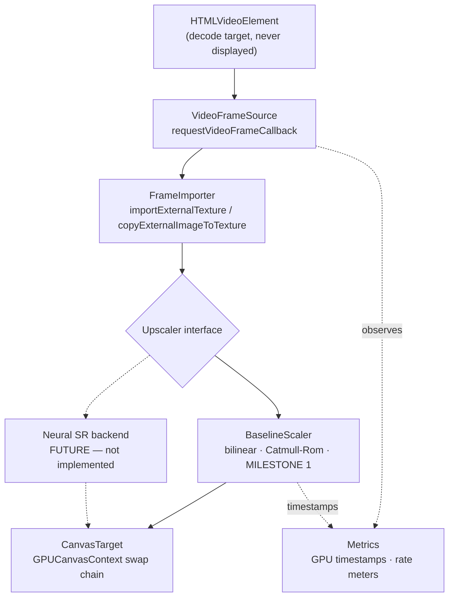

# ARCHITECTURE.md

AetherVSR upscales web video on the GPU, locally, in real time. This document
describes what exists today (Milestone 1: a non-neural WebGPU baseline) and the
boundary through which a neural stage will later arrive.

Nothing in the current codebase performs inference.

## Data flow



The solid path is implemented. The dashed path is the seam Milestone 2+ plugs
into.

## Stages

### 1. Frame acquisition — `src/core/acquisition/video-source.ts`

Turns an `HTMLVideoElement` into a stream of `FrameTick`s using
`requestVideoFrameCallback` (rVFC). rVFC fires when a frame is *sent to the
compositor*, so the pipeline is synchronised to presented video frames rather
than to display refresh. Callbacks are one-shot and re-registered every frame,
as the specification requires.

`FrameTick` normalises exactly what the pipeline needs: timestamp, media time,
decoded frame dimensions, presentation and expected-display times, the
`presentedFrames` delta, and the optional UA-reported decode latency.

An `requestAnimationFrame` fallback exists for browsers without rVFC. It is
selected by feature detection, not by browser sniffing; rVFC is available in
Chrome 83+, Safari 15.4+ and Firefox 132+, so the fallback is for older or
unusual engines.
It is explicitly a degraded mode: it ticks at display rate regardless of video
cadence, and the overlay labels it as such so its numbers are never mistaken
for rVFC numbers.

This stage holds no GPU resources. That is what makes it independently
testable — `test/video-source.test.ts` drives it with a controllable fake clock
and no GPU at all.

### 2. Frame import — `src/core/acquisition/frame-importer.ts`

Gets the decoded frame into GPU-visible form by one of two strategies, chosen
once at construction:

| Strategy | Mechanism | Notes |
|---|---|---|
| `external` | `GPUDevice.importExternalTexture()` | Wraps the decoder's surface. In Chromium this reaches a genuine no-copy path only when several internal conditions hold (shared image, NV12, multi-planar support, WebGPU-compatible backing, supported colour space); otherwise the browser copies internally. Zero-copy is an optimisation, not an API guarantee. |
| `sampled` | `GPUQueue.copyExternalImageToTexture()` into a texture we own and reuse | One GPU-side copy per frame. Used when external textures are unavailable, and forceable with `?import=copy` so the path stays testable on hardware that does not need it. |

Neither path reads pixels back to the CPU.

The distinction reaches the shader: an external texture is `texture_external` in
WGSL and can only be read with `textureSampleBaseClampToEdge`, while a copied
frame is an ordinary `texture_2d<f32>`. These are different types, so the
baseline scaler compiles a different shader module per strategy — resolved once
at configuration time, never branched per frame.

### 3. Upscale — `src/core/upscale/`

The replaceable stage. `Upscaler` (in `src/core/types.ts`) is the project's
central contract:

```ts
interface Upscaler {
  readonly id: string;
  readonly label: string;
  readonly scaleFactor: number;
  readonly neural: boolean;

  configure(config: UpscalerConfig): void;
  encode(ctx: EncodeContext): void;
  destroy(): void;
}
```

- `configure()` receives the device, source and target geometry, target format
  and source binding kind. Every GPU object an implementation needs is created
  here. It is called on start and on geometry change, never per frame.
- `encode()` runs in the hot path. It receives a command encoder, the frame, the
  destination view, and optional GPU timestamp slots. It must not allocate
  GPU resources, must not read back, and must not await.
- `scaleFactor` lets the harness size the output canvas without knowing the
  algorithm, so a 4x model needs no change to the pipeline, acquisition, import
  or presentation. It still needs an entry in the harness's upscaler list in
  `src/main.ts`.

`BaselineScaler` implements it with a single fullscreen render pass over a
three-vertex oversized triangle, in one of two reconstruction filters:

- **Bilinear** — one hardware-filtered tap. The cheap floor.
- **Catmull-Rom bicubic** — the separable 4x4 cubic evaluated as nine
  bilinear-fused taps rather than sixteen point taps. Sharper, with the ringing
  characteristic of a negative-lobe kernel; the result is clamped.

Both are deliberately non-neural. They exist to prove the path and to be the
quality and cost baseline every future model is measured against.

### 4. Presentation — `src/core/present/canvas-target.ts`

Owns the canvas and its swap chain. The backing store is set to exactly
`source x scaleFactor` — never multiplied by `devicePixelRatio`. A 1280x720
decode always produces a 2560x1440 buffer; CSS then letterboxes that fixed
buffer into the viewport. Conflating backing-store size with CSS size on a
Retina display is the standard way to end up benchmarking a scale factor you
did not intend.

The context is configured with the preferred canvas format (`bgra8unorm` on
macOS Chromium), `alphaMode: 'opaque'`, and `colorSpace: 'srgb'` to match the
destination colour space that `importExternalTexture()` converts into.

### 5. Metrics — `src/core/metrics/`

- `SampleWindow` — fixed-capacity ring buffer with mean, quantiles and max.
  Allocation-free on push.
- `RateMeter` — sliding-window rate over observed intervals, so it is exact for
  a periodic source and correct before the window fills.
- `GpuTimer` — real GPU execution time of the upscale pass via
  `timestamp-query`, using a fixed pool of resolve/staging buffers. A frame
  with no free slot is simply left unmeasured; the loop never blocks.

The overlay refreshes on a 250 ms timer, never from the frame callback, so that
measuring the pipeline cannot perturb the pipeline.

## Orchestration

`VideoPipeline` (`src/core/pipeline.ts`) wires the stages and owns the hot path.
Per frame it performs exactly: acquire tick, ensure configuration, mark meters,
import frame, claim a timestamp slot, create a command encoder, call
`upscaler.encode()`, resolve timestamps, submit, start the timestamp readback.
No awaits, no readbacks, no allocation beyond what WebGPU mandates.

## Where the neural stage goes

A neural backend is a new `Upscaler`. It will need more than the baseline does,
and the interface already anticipates it:

- **Multiple passes** — `encode()` receives the command encoder, so an
  implementation may record as many passes as it likes. `PassTiming` carries
  separate begin and end indices precisely so a multi-pass model reports its
  full cost rather than one convolution.
- **Intermediate buffers** — allocated in `configure()`, where sizes are known.
- **An ingest pass** — measurements in `BENCHMARKS.md` show the same nine-tap
  kernel costs markedly more in its render pass when reading through
  `texture_external` than through an ordinary `texture_2d<f32>` (3.90 ms vs
  1.55 ms). The *explanation* — that a multi-planar external texture performs
  plane sampling and colour conversion on every tap — is inferred from the
  specification and was not measured, and the copy path's own upload cost is
  not in that 1.55 ms. What is established is the render-pass difference, and
  it is enough to expect that a model reading the source many times will want
  one pass converting the external texture into a regular texture first. The
  `FrameTexture` union already lets a stage see which kind it has.
- **Weights and inference runtime** — outside the interface entirely. Whether
  the backend is hand-written WGSL or ONNX Runtime Web is an implementation
  detail of one `Upscaler`.

The constraint that must hold: adding a backend changes `src/core/upscale/`
plus its registration in the `FILTERS` list and construction site in
`src/main.ts`. It must not require changes to acquisition, import or
presentation.

## Deliberate non-goals for Milestone 1

No inference, no models, no temporal state, no frame interpolation, no
extension packaging, no tiling, no dynamic quality selection, no UI framework.
Each is listed in `ROADMAP.md` with the milestone that owns it.
