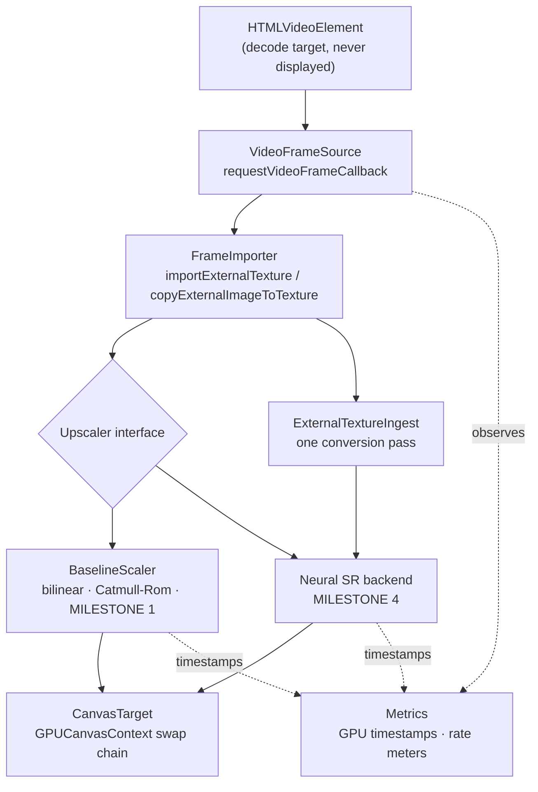

# ARCHITECTURE.md

AetherVSR upscales web video on the GPU, locally, in real time. This document
describes what exists today: a WebGPU video pipeline with two interchangeable
upscaling stages - the non-neural baseline scalers of Milestone 1 and the C16D2
neural network of Milestone 4.

Both run behind the same `Upscaler` interface, are selectable at runtime, and
the neural stage is automatically replaced by a baseline when it cannot hold the
frame budget. Milestones 2 and 3 added isolated neural/inference benchmark
experiments under `src/bench/` — convolution throughput harnesses, an
ONNX Runtime Web probe, a device roofline probe and a temporal-behaviour
harness — which are reachable only from `bench.html` and never from the
video path.

**What Milestone 3 settled about the neural stage, and Milestone 4 built.** Its
kernels are hand-written WGSL rather than a third-party runtime, and they took
the shape `src/bench/conv-blocked.wgsl.ts` established - see
`src/core/neural/conv.wgsl.ts`: workgroup-tiled with a halo, input channels
packed into `vec4`, several output channels accumulated per invocation, and
weights pre-arranged tap-major at load time. That shape is not a preference; it
is 8.3x faster than the naive kernel it replaced, and each part of it was
measured separately (`BENCHMARKS.md`). The operating point that fits the frame
budget is C16 at 1280x720, where one 3x3 layer costs 1.067 ms.

ONNX Runtime Web is not a candidate for the video path: version 1.29.0 cannot
accept a caller-supplied `GPUDevice`, so it cannot read a decoded frame without
a round trip through host memory (ADR-0018). `chromium-experimental-subgroup-matrix`
is rejected on measurement and on availability (ADR-0017).

## Data flow



Every path shown is implemented. `U` dispatches to exactly one of `B` or `N` per
frame; the budget guard decides which. Dotted edges are observation, not data
flow.

## Stages

### 1. Frame acquisition — `src/core/acquisition/video-source.ts`

Turns an `HTMLVideoElement` into a stream of `FrameTick`s using
`requestVideoFrameCallback` (rVFC). rVFC fires when a frame is *sent to the
compositor*, so the pipeline is synchronised to presented video frames rather
than to display refresh. Callbacks are one-shot and re-registered every frame,
as the specification requires.

`FrameTick` normalises exactly what the pipeline needs: timestamp, media time,
decoded frame dimensions, presentation and expected-display times, the
`presentedFrames` delta, and the optional UA-reported decode latency.

An `requestAnimationFrame` fallback exists for browsers without rVFC. It is
selected by feature detection, not by browser sniffing; rVFC is available in
Chrome 83+, Safari 15.4+ and Firefox 132+, so the fallback is for older or
unusual engines.
It is explicitly a degraded mode: it ticks at display rate regardless of video
cadence, and the overlay labels it as such so its numbers are never mistaken
for rVFC numbers.

This stage holds no GPU resources. That is what makes it independently
testable — `test/video-source.test.ts` drives it with a controllable fake clock
and no GPU at all.

### 2. Frame import — `src/core/acquisition/frame-importer.ts`

Gets the decoded frame into GPU-visible form by one of two strategies, chosen
once at construction:

| Strategy | Mechanism | Notes |
|---|---|---|
| `external` | `GPUDevice.importExternalTexture()` | Wraps the decoder's surface. In Chromium this reaches a genuine no-copy path only when several internal conditions hold (shared image, NV12, multi-planar support, WebGPU-compatible backing, supported colour space); otherwise the browser copies internally. Zero-copy is an optimisation, not an API guarantee. |
| `sampled` | `GPUQueue.copyExternalImageToTexture()` into a texture we own and reuse | One GPU-side copy per frame. Used when external textures are unavailable, and forceable with `?import=copy` so the path stays testable on hardware that does not need it. |

Neither path reads pixels back to the CPU.

The distinction reaches the shader: an external texture is `texture_external` in
WGSL and can only be read with `textureSampleBaseClampToEdge`, while a copied
frame is an ordinary `texture_2d<f32>`. These are different types, so the
baseline scaler compiles a different shader module per strategy — resolved once
at configuration time, never branched per frame.

### 3. Upscale — `src/core/upscale/`

The replaceable stage. `Upscaler` (in `src/core/types.ts`) is the project's
central contract:

```ts
interface Upscaler {
  readonly id: string;
  readonly label: string;
  readonly scaleFactor: number;
  readonly neural: boolean;

  configure(config: UpscalerConfig): void;
  encode(ctx: EncodeContext): void;
  destroy(): void;
}
```

- `configure()` receives the device, source and target geometry, target format
  and source binding kind. Every GPU object an implementation needs is created
  here. It is called on start and on geometry change, never per frame.
- `encode()` runs in the hot path. It receives a command encoder, the frame, the
  destination view, and optional GPU timestamp slots. It must not allocate
  GPU resources, must not read back, and must not await.
- `scaleFactor` lets the harness size the output canvas without knowing the
  algorithm, so a 4x model needs no change to the pipeline, acquisition, import
  or presentation. It still needs an entry in the harness's upscaler list in
  `src/main.ts`.

`BaselineScaler` implements it with a single fullscreen render pass over a
three-vertex oversized triangle, in one of two reconstruction filters:

- **Bilinear** — one hardware-filtered tap. The cheap floor.
- **Catmull-Rom bicubic** — the separable 4x4 cubic evaluated as nine
  bilinear-fused taps rather than sixteen point taps. Sharper, with the ringing
  characteristic of a negative-lobe kernel; the result is clamped.

Both are deliberately non-neural. They exist to prove the path and to be the
quality and cost baseline every future model is measured against.

### 4. Presentation — `src/core/present/canvas-target.ts`

Owns the canvas and its swap chain. The backing store is set to exactly
`source x scaleFactor` — never multiplied by `devicePixelRatio`. A 1280x720
decode always produces a 2560x1440 buffer; CSS then letterboxes that fixed
buffer into the viewport. Conflating backing-store size with CSS size on a
Retina display is the standard way to end up benchmarking a scale factor you
did not intend.

The context is configured with the preferred canvas format (`bgra8unorm` on
macOS Chromium), `alphaMode: 'opaque'`, and `colorSpace: 'srgb'` to match the
destination colour space that `importExternalTexture()` converts into.

### 4b. Ingest — `src/core/ingest/` (Milestone 2)

`ExternalTextureIngest` converts the imported frame into an ordinary
`GPUTexture` in a single pass. The baseline scaler does not use it — one tap
does not justify a pass — but any multi-tap consumer should.

This is measured, not assumed. A `texture_external` tap costs ≈0.360 ms per
720p frame against ≈0.100 ms for an ordinary `texture_2d<f32>` tap, and the
ingest pass costs ≈0.36–0.45 ms, so it repays itself at roughly two taps.
Nine-tap Catmull-Rom drops from 3.765 ms to 1.703 ms total GPU time. A 3x3
convolution reads nine times per output pixel *per input channel*.

The output is `TEXTURE_BINDING | RENDER_ATTACHMENT`, so it is both sampleable
by a convolution and usable as a ping-pong render target — the two things a
multi-pass neural graph needs. See DECISIONS.md ADR-0012.

### 5. Metrics — `src/core/metrics/`

- `SampleWindow` — fixed-capacity ring buffer with mean, quantiles and max.
  Allocation-free on push.
- `RateMeter` — sliding-window rate over observed intervals, so it is exact for
  a periodic source and correct before the window fills.
- `GpuTimer` — real GPU execution time of the upscale pass via
  `timestamp-query`, using a fixed pool of resolve/staging buffers. A frame
  with no free slot is simply left unmeasured; the loop never blocks.

The overlay refreshes on a 250 ms timer, never from the frame callback, so that
measuring the pipeline cannot perturb the pipeline.

## Orchestration

`VideoPipeline` (`src/core/pipeline.ts`) wires the stages and owns the hot path.
Per frame it performs exactly: acquire tick, ensure configuration, mark meters,
import frame, claim a timestamp slot, create a command encoder, call
`upscaler.encode()`, resolve timestamps, submit, start the timestamp readback.
No awaits, no readbacks, no allocation beyond what WebGPU mandates.

## The neural stage

`NeuralUpscaler` (`src/core/upscale/neural-upscaler.ts`) is a second
implementation of `Upscaler`, selected with `?upscaler=neural`. It is the whole
of Milestone 4, and it required no change to acquisition, import or
presentation — which was the point of the seam.

The graph, at 1280x720 in, 2560x1440 out:

```
GPUExternalTexture
  → ingest pass            external texture → rgba8unorm texture, once per frame
  → stem 5x5 3→16          texture-native, reads the image directly
  → body 2 × 3x3 16→16     packed vec4 activations, ping-pong buffers
  → resize-conv head       nearest 2x upsample then 3x3 16→3, writes a storage texture
  → blit                   storage texture → swap-chain view
```

Each stage is its own compute pass so each can be timed, and WebGPU's ordering
between passes in a command buffer means the ping-pong chain needs no explicit
barrier. The head is a resize convolution rather than a pixel shuffle for the
reasons in ADR-0022; the pixel-shuffle operator survives only under `src/bench/`
and nothing in `src/core/` imports it.

**Resources.** Everything is allocated in `configure()`: two activation buffers
sized to the largest layer, the ingest texture, the output storage texture,
weights, and a query set. The only per-frame GPU object is the bind group that
references the external-texture-derived view, and only when that view changes —
`GPUExternalTexture` is single-frame-valid by specification, so this is the one
allocation the `Upscaler` contract permits.

**Timing.** The pipeline's own span brackets the whole stage, from the first
pass to presentation, and that is the published number. Per-pass spans are
diagnostics on a separate query set, each aggregated over 240 samples; they are
never summed to produce the whole-stage figure, because measurements taken in a
tight loop and measurements taken in a live frame loop differ by up to 4x on
small passes (see ADR-0025). On the copy-import path there is no ingest pass, so
the stem opens the whole-stage span and gives up its own per-pass figure rather
than leaving the span half-written.

**Fallback.** `BudgetGuard` (`src/core/upscale/budget-guard.ts`) watches the
measured whole-stage time and swaps in the baseline scaler when the network
cannot hold the budget, recovering only via a probe that measures the network
itself. See ADR-0024.

## What a further backend would need

The interface anticipates more than the current model uses. A different
implementation may record as many passes as it likes, allocate intermediates in
`configure()`, and choose its own inference runtime — hand-written WGSL or ONNX
Runtime Web is an implementation detail of one `Upscaler`.

One measured constraint is worth carrying forward: the same nine-tap kernel
costs markedly more in its render pass when reading through `texture_external`
than through an ordinary `texture_2d<f32>` (3.90 ms vs 1.55 ms). The
*explanation* — that a multi-planar external texture performs plane sampling and
colour conversion on every tap — is inferred from the specification and was not
measured, and the copy path's own upload cost is not in that 1.55 ms. What is
established is the render-pass difference, and it is why a model that reads the
source many times wants an ingest pass first. `FrameTexture` lets a stage see
which kind it has.

The constraint that must hold: adding a backend changes `src/core/upscale/` plus
its registration in `src/main.ts`. It must not require changes to acquisition,
import or presentation.

## Milestone 2 feasibility bench — `bench.html`, `src/bench/`

A second Vite entry point, deliberately separate so experiment code never ships
in the baseline harness bundle: the ORT probe alone pulls a 25.7 MB WASM
artefact. It holds the ingest A/B experiment, a verified 3x3 convolution
throughput harness, an ONNX Runtime Web probe, and a deterministic image
quality evaluation. None of it is production code, and none of it performs
inference in the video path.

## Deliberate non-goals for Milestone 1

No inference, no models, no temporal state, no frame interpolation, no
extension packaging, no tiling, no dynamic quality selection, no UI framework.
Each is listed in `ROADMAP.md` with the milestone that owns it.
